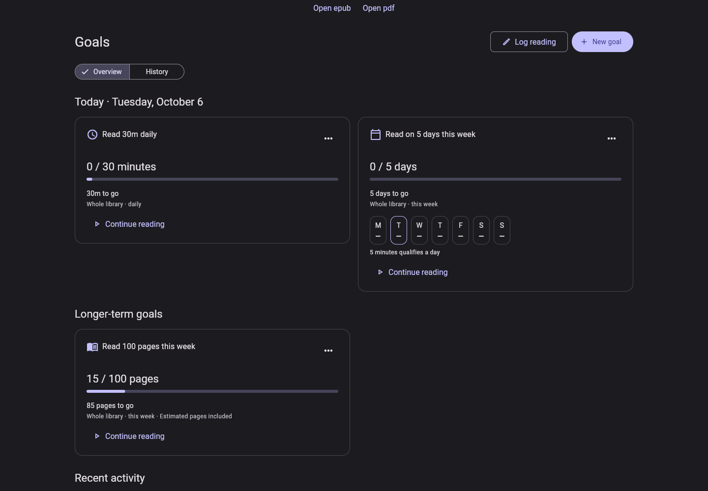
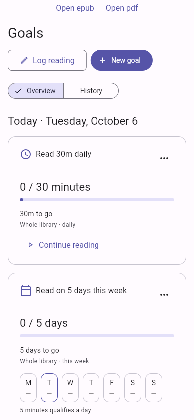

# Goals and reading activity

Goals project progress from the profile's durable reading ledger. The Goals page,
Dashboard, and Statistics use this same source; none seed example progress.

## Reading and completion

The reader reports readiness and visible document coverage through an optional,
Goals-independent callback. The host records foreground intervals every ten
seconds and flushes when leaving. Backgrounding, settings/contents panels, and
other routes pause recording; there is no inactivity timeout. Checkpoints use
stable UUIDs and the originating profile's repository, so retries do not increment
an editable counter or write into another profile.

PDF pages qualify after ten seconds of exposure. A jump contributes only exposed
pages, including spreads. EPUB estimates use normalized chapter content coverage
and the book's page-count metadata; screen pages and chapter numbers never count
as pages. A cover-only chapter or a book without page metadata still records time.
EPUB estimates assume equal calibration weight per spine chapter and are labeled
as estimates. Coverage is deduplicated per book and calendar day.

Reaching the end offers explicit completion confirmation. Library and book-details
status changes use the same operation. Rereading preserves completed status, and
undo appends reversals rather than deleting activity. Manual logs support physical
books, dates, duration, pages, completion, notes, and audited corrections.

## Rules and history

Goal definitions capture an IANA timezone, creation time, scope, and rule history.
Monday weeks and calendar days/months/years respect timezone transitions. Activity
before creation or during a pause does not count. Target/title revisions affect
the current and future periods; metric, cadence, scope, timezone, and reading-day
threshold changes save as a replacement goal, atomically archiving the original
definition with its history. The edit sheet previews this before saving. Recurring goals remain visible after
achievement and advance at calendar boundaries. Archive and deletion preserve
period history; activity retains book identity/title and shelf snapshots after
book deletion.

Duration is the union of eligible intervals, including concurrent devices. Pages
union stable document coverage; confirmed books count once per period. Reading
days default to five cumulative minutes. Period records retain rules, not editable
progress, and can be reprojected after corrections arrive.

## Sync and compatibility

`GET /v1/sync/settings` advertises `tracking_schema_version: 1`. New tables are
`reading_goals`, `reading_activities`, and `goal_periods`, with an owner-scoped JSON
payload. Older servers keep tracking in local-only `tracking_staging`. Queued
tracking after a server downgrade is retained there while ordinary library uploads
continue. Capability discovery promotes staged records atomically.

Deploy the server migration, PostgreSQL publication/grants, and PowerSync streams
before releasing this client. Versions are unchanged; merge feature PRs into
`development` and use the normal release workflow.

## Validation

The isolated validation host uses real EPUB/PDF files and records actual reading.
Its fixture-opening buttons are not part of the production Goals page.






Focused regressions cover calendar/DST rules, cross-device overlap/coverage,
completion undo, corrections, recurrence, profile switches, SQLite restart,
atomic position/activity writes, and older-server staging/promotion. Shared JSON
projection fixtures match server aggregation.

For real reader validation, serve an EPUB and PDF on a local HTTP fixture endpoint
as `/reader.epub` and `/reader.pdf` with CORS enabled. Fixtures are not committed.

```sh
# From app/, with an Android emulator running:
../../tools/flutter test --no-pub --no-enable-impeller --timeout=3m integration_test/reading_tracking_test.dart \
  -d emulator-5554 --dart-define=TRACKING_FIXTURE_ORIGIN=http://10.0.2.2:7311

# Local browser inspection, from app/:
../../tools/flutter run -d chrome -t tool/preview_goals.dart \
  --dart-define=TRACKING_FIXTURE_ORIGIN=http://127.0.0.1:7311
```

Manual logs, completion confirmations, and corrections share the installation
identity persisted in preferences; reader records retain their source.

The preview uses an isolated guest database and exposes development-only browser
inspection hooks. It is never included in the production entry point. Real
multi-device PowerSync transport testing remains a separate opt-in integration
lane requiring configured local services.
